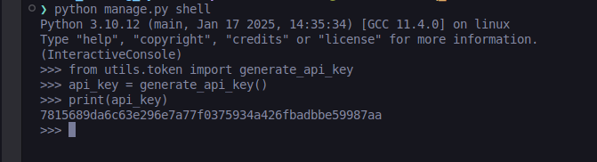

# WorkIndia Assignment - railway management system

- stateless user auth using JSWT
- added database lock to make sure ne user can successfully book seats when multiple users try to do so
- Secure admin endpoints by an API key for authe. Include the header 'X-IRCTC-API-KEY-SECRET' in all admin API requests to validate access


## Installation

clone the repo

```bash
  git clone https://github.com/HelixY2J/workindia_assignment.git
```
Craete a virtuale env

```bash
  virtualenv venv
```

For linux - 

```bash
  source venv/bin/activate
  pip install -r requirement.txt

```


FOr windows:

```bash
  ./venv/Scripts/activate
  pip install -r requirement.txt

```

Create migrations and migrate them

```bash
  python manage.py makemigrations
  python manage.py migrate
```

we need to configure the database creds. Create a .env file, add the environment variables as shown in .env.example

The docker compose file has the postgres container and django app running on same network. Run the command to start the containers - 

```bash
  sudo docker-compose up 
```

If you experience any issues with docker, you can still run the application by 
adding Postgrec creds in .env file

And run the project by

```bash
  python manage.py runserver
```

we need to first register a user and login, notes the access token recieved.
We can use this token for user api

To access the Admin API we need to create token by using function `generate_api_key` present in `utils/token.py` and add to the db `AdminSecret`.




##  Endpoints


The app defines following CRUD APIs.

    POST /api/public/account/register
    POST /api/public/account/login
    POST /api/admin/booking/add_train
    POST /api/admin/booking/add_train_schedule
    POST /api/user/booking/book_ticket
    GET /api/user/booking/get_trains
    GET /api/user/booking/get_booking/{booking_uuid}
    PATCH /api/admin/booking/update_train_schedule/{schedule_id}


## output

- Register User


- Unauthorized user


- Login

